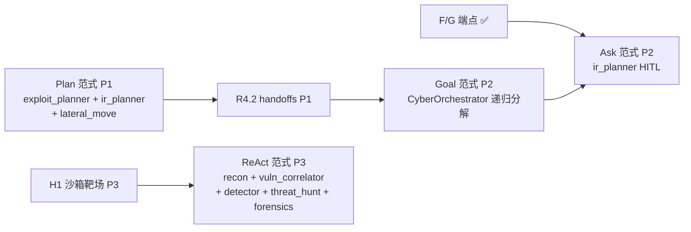

# plan.md — AegisOS 动态开发计划

> **本文件是项目的「活计划」**，整合了 `specs/plans/13`（前后端全流程）、`14`（赛事总体方案）、`15`（实施任务清单）的核心内容，动态维护当前未完成的内容和下一步计划。
>
> **结构**：待完成在前（§1-§7）→ 已完成在后（§8-§10）→ 附录（§11-§12）
>
> 维护规则：
> 1. 每完成一个任务 → 勾选 `[x]` + 在 `developer/CHANGELOG.md` 记录
> 2. 每新增计划项 → 添加到对应 Phase 下，标注优先级（P0 最高）
> 3. 每次会话结束前 → 更新「最近变更」段
> 4. 本文件已整合 `roadmap/`（阶段总览，详见附录 D）；`roadmap/` 仍作为 SSOT 保留
> 5. `specs/plans/13`、`14`、`15` 及 `roadmap/` 仍作为 SSOT 保留，本文件为执行态整合视图
>
> 最后更新：2026-07-06 · **151 测试全通过** · SDK 集成 S1-S4 ✅ · R2 清理 ✅ · R3 结构化输出 ✅ · 编排器 e2e ✅ · B3 ✅ · E13 ✅ · 文档对齐 ✅ · 整合 roadmap ✅ · SDK 重构排查 ✅ · R4-R5 详细计划 ✅ · P1 编排器实现 ✅ · **F 后端端点 ✅ · G 前端视图 ✅** · **计划优先级调整 ✅（容器化后移 P3）**

---

## 📊 总览

| 维度 | 状态 |
|------|------|
| **当前阶段** | P5 ✅ + P6 部分 + **SDK 集成 S1-S4 ✅** + R2-R3 ✅ + R4-R5 详细计划已定 + **赛事 Phase F ✅ · G ✅** · 功能实现推进中 |
| **测试** | **151 passed**（protocol 6 + memory 33 + planning 54+9+5 + tools 5 + action 19 + perception 4 + e2e 9 + backend cyber 11 + frontend cyber 21） |
| **已完成 Phase** | A ✅ · B ✅ · C ✅ · D ✅ · E ✅ · 前后端打通 ✅ · SDK 集成 S1-S4 ✅ · R2 Provider 清理 ✅ · R3 结构化输出 ✅ · 文档对齐 ✅ · P1 编排器 ✅ · **F ✅ · G ✅** · **R4.1-R4.3 ✅** |
| **待完成 Phase** | **P1**：R4 SDK 编排深化（R4.4-R4.8 剩 5 项）· R5 旧接口清理+流式+事件总线（5 项）· AP1 Plan 范式 · **P2**：H2 数据层 · H5 可观测评测 · AP3 Goal 范式 · AP4 Ask 范式 · 记忆/感知/工具层补全 · **P3**：~~H1 沙箱靶场~~ · ~~AP2 ReAct 范式~~ · ~~H7 部署交付~~ · ~~工程支撑~~（容器化/部署后移） |
| **赛事截止** | 2026-09-15（XH-202631 荣耀·超长程群体智能） |

### 赛事对齐（详见 §11 附录）

| 评分维度 | 占比 | 对应任务 | 状态 |
|---------|------|---------|------|
| 完整性 | 40 | 8 域全实现 + 3 场景可演示 + 回放 | A-E ✅ / F-H 🔲 |
| 应用创新 | 25 | 攻防对抗仿真 + 跨领域 3 场景 | Agent ✅ / 场景 🔲 |
| 技术创新 | 20 | 动态异构拓扑 + 低熵路由 + 神经符号闭环 + 记忆压缩唤醒 | C/D/B/E ✅ |
| 性能 | 15 | benchmark + 端边云三层调度优化 | 调度 ✅ / 评测 🔲 |

### 3 场景覆盖

| 场景 | 描述 | 依赖 | 状态 |
|------|------|------|------|
| 场景 1 | 网络防御（红→蓝→紫完整链路） | B3 + E13 + 编排器 + F + G | ✅ 可演示 |
| 场景 2 | 超长程攻击链（多步横向移动） | 场景 1 + R4 handoffs + Plan 范式 | 🔲 待做（功能优先） |
| 场景 3 | 端-边-云协同防御 | 场景 1 + H7 端边云（后移 P3） | 🔲 待做（容器化后） |

### 🔥 P0 — 立即执行（本周）

> ✅ B3 + E13 + 编排器 + F + G 全部完成（2026-07-06）。**计划调整（2026-07-06）**：容器化/部署相关任务（H1 沙箱靶场、H7 部署交付、AP2 ReAct 范式）全部后移至 P3，先集中精力完成功能实现。
>
> **下一步优先顺序**：
> 1. ~~**R4.1** neuro_symbolic→SDK（P0 阻塞项，唯一未迁移的 LLM 调用点）~~ ✅ 完成
> 2. ~~**R4.2-R4.3** SDK 编排器深化（handoffs/guardrails）~~ ✅ 完成
> 3. **R4.4-R4.8** SDK 编排器深化（tracing/FunctionTool/MockRuntime/composition/测试）
> 4. **R5.1-R5.5** 旧接口清理 + 流式输出 + 事件总线
> 5. **AP1** Plan 范式（与 R4 并行，纯 LLM 推理增强，不依赖容器化）

### ⚡ P1 — 短期（1-2 周）

> **功能优先策略（2026-07-06 调整）**：以下任务均为纯功能实现，不依赖容器化，优先完成。

#### 编排器实现（P5 收尾）✅
> **优先级**：P1 · **预估**：2-3 天 · **阻塞**：E13、F · **状态**：✅ 已完成（2026-07-06）
- [x] `aegisos_agents/planning/planner/` Planner 实现（任务分解 → 子任务 DAG）— `planner.py`：4 场景模板（cyber_red/blue/purple/generic），纯算法不调 LLM，输出 `protocol.Plan`
- [x] `aegisos_agents/planning/orchestrator/` Orchestrator 实现（多 Agent 编排调度）— `orchestrator.py`：整合 Planner + WorkflowEngine + EventBus，`execute(goal, runtime)` 一站式编排
- [x] `aegisos_agents/planning/engine/workflow/` Workflow 引擎（DAG 执行）— `engine.py`：Kahn 拓扑排序 + ThreadPoolExecutor 并行 + 条件分支 + 失败传播 + 循环检测
- [x] `aegisos_agents/planning/engine/eventbus/` EventBus 实现（8 事件发布/订阅）— `impl.py`：topic 路由 + FIFO 顺序 + 异常隔离死信队列 + 历史回放
- [x] 编排器集成 MockRuntime → 替换为真实 Runtime — `runtime.py`：`CyberRuntime` 委托 `CyberOrchestrator` 红蓝紫链，实现 `RuntimeAPI`，替代 MockRuntime 85 行 dispatch map

#### F — 后端攻防 REST 端点
> **优先级**：P1 · **预估**：2 天 · **依赖**：编排器 · **状态**：✅ 已完成（2026-07-06）
- [x] F1 `backend/routers/range.py` 靶场管理端点（`/api/v1/range/start` · `/api/v1/range/{id}`）
- [x] F2 `backend/routers/range.py` 拓扑端点（`/api/v1/range/{id}/topology`）
- [x] F3 `backend/routers/attack.py` 攻击端点（`/api/v1/attack` · `/api/v1/attack/chain/{id}`）
- [x] F4 `backend/routers/defense.py` 防御端点（`/api/v1/defense` · `/api/v1/defense/{id}` · `/api/v1/defense/purple-review`）
- [x] F5 `protocol/cyber.py` ThreatIntel 补充 ATT&CK 技战术映射字段 + `backend/routers/threat.py` 威胁情报端点
- [x] F6 后端测试：攻防端点集成测试（11 测试方法全通过）

#### G — 前端攻防视图
> **优先级**：P1 · **预估**：3-4 天 · **依赖**：F · **状态**：✅ 已完成（2026-07-06）
- [x] G1 `frontend/src/views/cyber/RedTeamPanel.tsx` 攻击链 DAG 可视化（自定义 SVG，非 React Flow）
  - 节点：Asset / AttackStep + 颜色区分（蓝=资产，红=攻击步骤）
  - 边：贝塞尔曲线 + 箭头标记
  - 漏洞发现表 + CVSS 评分徽章
- [x] G2 `frontend/src/views/cyber/BlueTeamPanel.tsx` 防御看板
  - 告警列表 + 严重度排序（critical/high→danger，medium→warning，low→success）
  - 响应计划 + 执行状态 + 置信度 + 回滚信息
  - 安全假设列表
- [x] G3 `frontend/src/views/cyber/PurpleTeamPanel.tsx` 时序回放
  - Critique/Review 裁决展示
  - 攻击链时间轴回放（Play/Pause/Step forward/backward）
- [x] G4 `frontend/src/views/cyber/ThreatIntelPanel.tsx` ATT&CK 威胁情报表
  - 战术过滤按钮（9 个战术）
  - 可展开行显示 technique_id / detection / mitigation / refs
- [x] G5 `frontend/src/protocol/types.ts` 补充 cyber 类型映射（ThreatIntel 扩展 + RangeResponse/RedAttackResponse/BlueDefenseResponse/PurpleReviewResponse/TopologyResponse）
- [x] G6 前端测试：cyber API service 单元测试（12）+ 视图组件渲染测试（9）= 21 测试全通过

#### R4 — SDK 编排器深化（功能优先）
> **优先级**：P1 · **预估**：5 天 · **状态**：� 进行中（R4.1-R4.3 ✅ 完成 2026-07-08，R4.4-R4.8 待做）
> 当前 `cyber_orchestrator.py` 已用 SDK Agent，但编排是手动 `_run()` 串联，未用 SDK 原生 handoffs/guardrails/tracing。
>
> **执行路线图**（R4 8 项，预估 5 天）：
> ```
> R4.1 neuro_symbolic→SDK(P0) ──┐
>                               ├→ R4.2 handoffs ──┬→ R4.3 guardrails ──→ R4.4 tracing ──→ R4.5 FunctionTool(*)
>                               │                    │
>                               │                    └→ R4.6 MockRuntime ──→ R4.7 composition ──→ R4.8 测试
> ```
> (*) R4.5 FunctionTool 的沙箱执行依赖 H1，但工具注册接口可先实现
>
> **进度（2026-07-08）**：✅ R4.1 · ✅ R4.2 · ✅ R4.3 · 🔲 R4.4-R4.8
> - R4.1：`NeuroSymbolicAgent(StructuredAgent[ExploitPlannerResult])`，`_run()` 替代 `provider.complete()`，`validate_chain()` 保留纯函数，未用 guardrail（SDK 抛异常不自动重试，保留手动 `validate_and_fix` 循环）。4 测试通过。
> - R4.2：添加 `ChainContext` 共享上下文 + `run_red_chain_via_handoffs` / `run_blue_chain_via_handoffs` + `on_handoff` 回调 + handoff 声明式链（mock 回退手动链）。保留手动链为默认路径（固定管道正确架构）。9 测试通过。
> - R4.3：`create_attack_chain_guardrail()` 返回 `@output_guardrail` + `run_red_chain_with_guardrail()` 手动捕获 `OutputGuardrailTripwireTriggered` + 重试循环 + 反馈注入。SDK guardrail 抛异常不自动重试→手动重试。5 测试通过。

- [x] **R4.1** `perception/reasoning/neuro_symbolic.py` 迁移到 SDK（**P0**，0.5 天）✅ 2026-07-08
- [x] **R4.2** `cyber_orchestrator.py` 用 SDK `Agent.handoffs` 替代手动串联（1 天）✅ 2026-07-08
- [x] **R4.3** `cyber_orchestrator.py` 用 SDK `output_guardrails` 实现紫队校验闭环（0.5 天）✅ 2026-07-08
- [ ] **R4.4** `cyber_orchestrator.py` 用 SDK `tracing` + `AgentHooks` 替代手动日志（0.5 天）
- [ ] **R4.5** `cyber_orchestrator.py` 用 SDK `FunctionTool` 注册攻防工具（0.5 天）
- [ ] **R4.6** `backend/mocks/runtime.py` MockRuntime 替换为 CyberOrchestrator 调用（0.5 天）
- [ ] **R4.7** `backend/core/composition.py` 注入 CyberOrchestrator（0.5 天）
- [ ] **R4.8** 测试全通过

#### R5 — 旧接口清理 + 流式输出 + 事件总线（功能优先）
> **优先级**：P1 · **预估**：3 天 · **状态**：🔲 待做（功能优先，不依赖容器化）
> SDK 迁移后旧接口仅被 MockProvider 残留使用，可安全清理。

- [ ] **R5.1** `aegisos_agents/tools/llms/base.py` 清理旧接口（0.5 天）
- [ ] **R5.2** `aegisos_agents/tools/llms/model_router.py` 简化（0.5 天）
- [ ] **R5.3** SDK `Runner.run_streamed()` → SSE → 前端实时展示（1 天）
- [ ] **R5.4** 事件总线实现（0.5 天）
- [ ] **R5.5** 测试全通过

<details>
<summary>📖 R4-R5 详细方案（点击展开）</summary>

**阶段 4: SDK 编排器深化**（≤6 文件）

> **SDK 能力点对照**（本阶段使用的 SDK API）：
> | SDK API | 用途 | 当前替代物 |
> |---------|------|-----------|
> | `Agent.handoffs: list[Agent]` | 声明式 Agent 链式调用，SDK 自动管理状态传递+对话历史 | 手动 `_run()` + `json.dumps()` 串联 |
> | `handoff(agent, on_handoff=callback, input_type=Pydantic)` | 配置 handoff 回调 + 结构化输入类型 | 无 |
> | `Agent.input_guardrails: list[InputGuardrail]` | 输入校验（在 LLM 调用前拦截不合规输入） | 无 |
> | `Agent.output_guardrails: list[OutputGuardrail]` | 输出校验（LLM 返回后自动校验，失败触发重试） | 手动 `if critique.valid == False` |
> | `input_guardrail(func)` / `output_guardrail(func)` | 装饰器创建 guardrail，返回 `GuardrailFunctionOutput(tripwire=bool)` | 无 |
> | `Agent.hooks: AgentHooks` | 生命周期回调（`on_start`/`on_end`/`on_tool_start`/`on_tool_end`/`on_handoff`/`on_llm_start`/`on_llm_end`） | 手动 `print` / 日志 |
> | `trace(workflow_name, metadata)` | 上下文管理器，创建 trace span 包裹整个编排流程 | 无 |
> | `RunConfig(tracing=...)` / `set_trace_processors([...])` | 配置 tracing 输出到自定义 processor（可转 JSON / 可视化） | 无 |
> | `Runner.run_streamed(agent, input)` | 异步流式执行，返回 `RunResultStreaming`，可迭代 `stream_events()` | `Runner.run_sync()` 同步 |
> | `FunctionTool(name, params_json_schema, on_invoke_tool)` | 将 Python 函数注册为 SDK 工具，LLM 可自动调用 | 无 |
> | `AgentOutputSchema(type, strict_json_schema=False)` | 包装含 `dict` 字段的 Pydantic 类型通过 SDK 校验 | 已在 `StructuredAgent` 中使用 |

- [x] **R4.1** `perception/reasoning/neuro_symbolic.py` 迁移到 SDK（**P0**，0.5 天）✅ 2026-07-08
  - 当前：旧 `ModelProvider.complete()` + `json.loads` + `try/except` 手写解析
  - 迁移方案：继承 `StructuredAgent[ExploitPlannerResult]`，用 SDK `output_type`（Pydantic `ExploitPlannerResult`）替代手写 JSON 解析
  - 符号侧 `validate_chain()` 保留（纯规则校验，不涉及 LLM）
  - ⚠️ **未用 SDK `output_guardrail`**：SDK guardrail 抛 `OutputGuardrailTripwireTriggered` 异常后不自动重试，保留手动 `validate_and_fix()` 循环（`max_iterations`）+ `_run()` 调用
  - 关键代码：`NeuroSymbolicAgent(StructuredAgent[ExploitPlannerResult])` + `_regenerate()` 用 `self._run()` + `_result_to_chain()` 转换
  - 删除 `LLMRequest`/`LLMResponse`/`ModelProvider` 依赖 + `json.loads` + `try/except`
  - `NeuroSymbolicLoop = NeuroSymbolicAgent` 别名向后兼容
  - 测试：4 个既有测试全通过（`test_validate_chain_*` / `test_loop_*`）
  - **变更文件**：`aegisos_agents/perception/reasoning/neuro_symbolic.py`

- [x] **R4.2** `cyber_orchestrator.py` 用 SDK `Agent.handoffs` 替代手动串联（1 天）✅ 2026-07-08
  - 当前：`run_red_chain()` 手动 `recon._run() → json.dumps → vuln._run() → json.dumps → exploit._run()`，手动管理状态传递
  - **实现决策**：SDK handoffs 是 LLM 驱动动态路由（LLM 决定是否 `transfer_to_*`），非固定顺序管道。对红蓝固定链，手动顺序执行是正确架构。采用**混合方案**：
    - 保留手动链 `run_red_chain()` / `run_blue_chain()` 为默认路径
    - 新增 `run_red_chain_via_handoffs()` / `run_blue_chain_via_handoffs()` 声明式链（mock 回退手动链）
    - `ChainContext` dataclass 跨 handoff 共享上下文，累积各步产出
    - `on_handoff` 回调（1 参数版本，不配 `input_type`）标记各步完成
    - SDK `handoff(target, on_handoff=cb)` 声明式串联
  - SDK handoff 规则发现：不配 `input_type` 时 `on_handoff` 只接收 1 参数 (context)；配 `input_type` 时接收 2 参数 (context, input)
  - Mock 模式下 `MockSDKModel` 返回纯文本（非工具调用），LLM 不触发 handoff → 自动回退手动链
  - 测试：9 测试通过（`test_cyber_handoffs.py`）
  - **变更文件**：`cyber_orchestrator.py` + `__init__.py`（导出 `ChainContext`）+ 新增 `test_cyber_handoffs.py`

- [x] **R4.3** `cyber_orchestrator.py` 用 SDK `output_guardrails` 实现紫队校验闭环（0.5 天）✅ 2026-07-08
  - 当前：`run_purple_review()` 手动调用 `critic._run()` → `if critique.valid == False` 一次性判断
  - **实现决策**：SDK guardrail 触发 `tripwire_triggered=True` 后抛 `OutputGuardrailTripwireTriggered` 异常，**不自动重试**。需手动捕获 + 重试循环：
    - `create_attack_chain_guardrail()` 返回 `@output_guardrail(name="attack_chain_validator")` 装饰的 `OutputGuardrail`
    - `run_red_chain_with_guardrail()` 注入 guardrail 到 `exploit_planner._sdk_agent.output_guardrails`
    - 捕获 `OutputGuardrailTripwireTriggered` → 从 `e.guardrail_result.output.output_info` 提取反馈 → 重新调用 `_run()` 注入反馈 prompt
    - 最多重试 `max_retries` 次，完成后清理 `output_guardrails = []`
    - 返回 `guardrail_passed: bool` + `guardrail_feedback: str`
  - 校验逻辑：chain_id 非空 + steps 非空 + 每步有 technique
  - 测试：5 测试通过（`test_cyber_guardrails.py`）
  - **变更文件**：`cyber_orchestrator.py` + 新增 `test_cyber_guardrails.py`

- [ ] **R4.4** `cyber_orchestrator.py` 用 SDK `tracing` + `AgentHooks` 替代手动日志（0.5 天）
  - 当前：无 tracing，手动 `print` 或无日志
  - 迁移方案：
    - 用 `trace(workflow_name="cyber_red_chain", metadata={"scenario": "s1"})` 上下文管理器包裹编排调用
    - 实现 `AgentHooks` 子类：`on_start`/`on_end`/`on_tool_start`/`on_tool_end`/`on_handoff` → 写入 `observability/inspect/monitor/` 结构化日志
    - 用 `set_trace_processors([custom_processor])` 将 `RunTrace` 导出为 JSON，供 `observability/inspect/replay/` 时序回放消费
    - `RunConfig(tracing=TracingConfig(enabled=True))` 全局开启
  - 替代手写日志 + 为 H5.2 回放功能提供数据源
  - 测试：验证 trace JSON 输出结构正确

- [ ] **R4.5** `cyber_orchestrator.py` 用 SDK `FunctionTool` 注册攻防工具（0.5 天）
  - 当前：Agent 无工具调用能力，所有输入来自编排器手动传参
  - 迁移方案：用 `FunctionTool(name="nmap_scan", params_json_schema={...}, on_invoke_tool=callback)` 将沙箱工具注册为 SDK 工具
  - Agent 的 `tools=[nmap_tool, ...]` 属性配置，SDK 自动处理 LLM tool_call → 函数调用 → 结果返回
  - 红队工具：`nmap_scan`/`metasploit_exploit`/`lateral_move_exec`（Docker 沙箱内执行）
  - 蓝队工具：`query_attck_kb`/`query_cve_db`/`correlate_alerts`（查知识库）
  - `tool_use_behavior='stop_on_first_tool'`：工具返回即作为最终输出（适合 recon 类 Agent）
  - 安全约束：`needs_approval=True` 用于高危操作（exploit），编排器审批后才执行
  - 测试：Mock 工具调用链路

- [ ] **R4.6** `backend/mocks/runtime.py` MockRuntime 替换为 CyberOrchestrator 调用（0.5 天）
  - 当前：85 行 `_cyber_dispatch_map()` 手写 handler + 类型转换
  - 迁移方案：MockRuntime 内部委托 `CyberOrchestrator.run_red_chain()` / `run_blue_chain()` / `run_purple_review()`
  - 删除 dispatch map，保留 RuntimeAPI 接口签名不变（向后兼容）
  - 测试：既有 e2e 测试全通过

- [ ] **R4.7** `backend/core/composition.py` 注入 CyberOrchestrator（0.5 天）
  - 当前：注入 MockRuntime（含手写 dispatch）
  - 迁移方案：DI 组合根注入 `CyberOrchestrator(mock=MockProvider())`，Mock 模式下走预置响应
  - 真实模式：`CyberOrchestrator(model=SDKProvider().get_sdk_model())`
  - 测试：后端集成测试全通过

- [ ] **R4.8** 测试全通过

**阶段 5: 旧接口层清理 + 流式输出 + 事件总线**（≤4 文件）

- [ ] **R5.1** `aegisos_agents/tools/llms/base.py` 清理旧接口（0.5 天）
  - 删除 `LLMRequest`/`LLMResponse`/`ModelProvider` Protocol（R4.1 完成后无消费者）
  - 保留 `MockProvider`（测试依赖，`MockSDKModel` 内部委托）
  - `MockProvider` 改为直接返回 dict（不再包装为 `LLMResponse`）

- [ ] **R5.2** `aegisos_agents/tools/llms/model_router.py` 简化（0.5 天）
  - 当前：手写 `MODEL_PREFIX_MAP` + `TIER_PROVIDER_MAP` 三层映射
  - 简化方案：SDK `ModelProvider` 已内置模型路由，`model_router` 降级为配置层（仅保留 tier→model_id 映射，不再创建 Provider 实例）
  - 或直接删除，模型选择由 `RunConfig(model=...)` 或 `Agent(model=...)` 指定

- [ ] **R5.3** SDK `Runner.run_streamed()` → SSE → 前端实时展示（1 天）
  - 后端：`backend/routers/stream.py` 用 `Runner.run_streamed()` 替代 `Runner.run_sync()`
  - `RunResultStreaming.stream_events()` → 逐事件 yield → SSE `EventSource` 推送前端
  - 前端：`frontend/views/chat/ChatView.tsx` 订阅 SSE，实时展示 Agent 思考过程 + handoff 过程 + tool 调用
  - 评委演示效果：实时看到 Agent 编排流程逐步展开
  - SDK 能力：`AgentUpdatedStreamEvent` / `AgentToolStreamEvent` / `HandoffOutputItem` 事件类型

- [ ] **R5.4** 事件总线实现（0.5 天）
  - 新建 `aegisos_agents/planning/engine/eventbus/impl.py`
  - 基于 SDK `AgentHooks`（`on_start`/`on_end`/`on_handoff`）发布事件到 `protocol/event.py` 的 8 种事件类型
  - 或用 `blinker` 库实现发布/订阅，`AgentHooks` 作为事件源
  - 替代 MockRuntime 中的手动事件分发

- [ ] **R5.5** 测试全通过

</details>

#### AP1 — Plan 范式（功能优先，不依赖容器化）
> **优先级**：P1 · **预估**：2-3 天 · **依赖**：R4（可并行）· **状态**：🔲 待做
> Plan 范式为纯 LLM 推理增强，不依赖 Docker 沙箱，可独立实现。

- [ ] AP1.1 `perception/reasoning/strategies/plan_mode.py` — Plan 行动模式实现
  - 接口：`plan(task, context) -> PlanResult`（高层策略 + 步骤分解）
  - 用 SDK `Agent` + 两阶段 prompt：阶段 1「分析目标 + 生成策略」，阶段 2「按策略逐步生成详细产出」
  - 可复用 `StructuredAgent` 基类，阶段 1 output_type 为 `PlanResult`（策略 + 步骤列表），阶段 2 output_type 为各 Agent 原有 output_type
- [ ] AP1.2 `exploit_planner` 接入 Plan 范式 — 先规划攻击策略（入口资产、攻击路径、目标），再生成详细 AttackChain
- [ ] AP1.3 `ir_planner` 接入 Plan 范式 — 先规划多阶段响应策略（隔离→阻断→诱饵→监控），再生成详细 DefenseAction 列表
- [ ] AP1.4 `lateral_move` 接入 Plan 范式 — 先规划移动策略（可达性分析 + 优先路径），再生成 AttackStep 列表
- [ ] AP1.5 测试：Plan 范式模式下 3 个 Agent 输出质量提升验证

### 📅 P2 — 中期（赛事前）

> **功能优先策略（2026-07-06 调整）**：以下任务均为功能实现，不依赖容器化。容器化/部署任务（H1 沙箱靶场、H7 部署交付、ReAct 范式）已后移至 P3。

#### H2 — 数据层接入
> **优先级**：P2 · **预估**：2-3 天 · **状态**：🔲 待做（功能优先）
- [ ] H2.1 `data/models/` Neo4j 拓扑图 + ATT&CK 图接入
- [ ] H2.2 `data/models/` Qdrant 向量库接入
- [ ] H2.3 `aegisos_agents/memory/vector/` 对接 Qdrant
- [ ] H2.4 `aegisos_agents/memory/semantic/` 对接 Neo4j ATT&CK 图

#### H5 — 可观测与评测
> **优先级**：P2 · **预估**：2-3 天 · **状态**：🔲 待做（功能优先）
- [ ] H5.1 `observability/inspect/monitor/` 实时监控实现
- [ ] H5.2 `observability/inspect/replay/` 攻击链回放实现
- [ ] H5.3 `observability/measure/benchmark/` 性能基准测试
- [ ] H5.4 `observability/measure/evaluation/` 5 维度评测（准确率/召回率/延迟/资源/鲁棒性）
- [ ] H5.5 `observability/present/visualization/` 数据可视化

#### 记忆子系统补全（7 个空模块）
> **优先级**：P2 · **预估**：2 天 · **状态**：🔲 待做（功能优先）
- [ ] `aegisos_agents/memory/archive/` 归档记忆
- [ ] `aegisos_agents/memory/cache/` 缓存记忆
- [ ] `aegisos_agents/memory/checkpoint/` 检查点
- [ ] `aegisos_agents/memory/reflection/` 反思记忆
- [ ] `aegisos_agents/memory/retrieval/` 检索
- [ ] `aegisos_agents/memory/snapshot/` 快照
- [ ] `aegisos_agents/memory/sync/` 同步

#### 感知层补全
> **优先级**：P2 · **预估**：1-2 天 · **状态**：🔲 待做（功能优先）
- [ ] `aegisos_agents/perception/context/` 上下文管理
- [ ] `aegisos_agents/perception/reflection/` 反思

#### 工具层补全
> **优先级**：P2 · **预估**：1 天 · **状态**：🔲 待做（功能优先）
- [ ] `aegisos_agents/tools/prompts/` Prompt 管理
- [ ] `aegisos_agents/tools/runtime/` 工具运行时

### 📋 P3 — 长期 / 容器化与部署

> **容器化后移策略（2026-07-06 调整）**：所有容器化/部署相关任务后移至此处，等功能实现全部完成后再进行。

#### H1 — Docker 沙箱靶场
> **优先级**：P3 · **预估**：3-5 天 · **状态**：🔲 后移（原 P2）
- [ ] H1.1 `infrastructure/delivery/deployment/` Docker Compose 靶场编排
- [ ] H1.2 攻防工具容器化（nmap/metasploit/zeek/splunk 等）
- [ ] H1.3 `infrastructure/transport/communication/` 容器间通信
- [ ] H1.4 靶场安全隔离（永不触真实网络）

#### H7 — 部署交付
> **优先级**：P3 · **预估**：3-5 天 · **状态**：🔲 后移（原 P2）
- [ ] H7.1 `infrastructure/delivery/deployment/docker/Dockerfile.backend` — 后端镜像
- [ ] H7.2 `infrastructure/delivery/deployment/docker/Dockerfile.frontend` — 前端镜像（多阶段构建：node build → nginx serve）
- [ ] H7.3 `infrastructure/delivery/deployment/docker/docker-compose.yml` — 一键编排（backend + frontend + nginx + db）
- [ ] H7.4 `infrastructure/delivery/deployment/nginx/nginx.conf` — Nginx 反向代理配置
  - 前端静态文件服务（`dist/`）
  - `/api/` → backend:8000 REST 代理
  - `/ws/` → backend:8000 WebSocket 升级代理
  - gzip 压缩 + 连接超时
- [ ] H7.5 `infrastructure/delivery/deployment/nginx/conf.d/aegisos.conf` — 站点配置
- [ ] H7.6 `infrastructure/nodes/edge/` 端侧节点实现
- [ ] H7.7 `infrastructure/nodes/cloud/` 云侧节点实现
- [ ] H7.8 端边云协同联调
- [ ] H7.9 `tooling/scripts/` 靶场编排脚本

#### Agent 框架规范化与替换（详见 `docs/RESEARCH_AGENT_FRAMEWORK_REFACTOR.md`）
> **优先级**：P3 · **预估**：5-7 天 · **收益**：代码量 -70%，新增 checkpoint/流式/100+模型兼容

**阶段 1: Protocol → Pydantic**（1 域 / ≤8 文件）
- [ ] R1.1 `protocol/cyber.py` → Pydantic BaseModel（删除手写 `to_dict()` / `from_dict()`）
- [ ] R1.2 `protocol/message.py` → Pydantic
- [ ] R1.3 `protocol/graph.py` → Pydantic
- [ ] R1.4 `protocol/agent.py` / `event.py` / `scheduler.py` / `memory.py` → Pydantic
- [ ] R1.5 `protocol/tool.py` / `heartbeat.py` / `sync.py` → Pydantic
- [ ] R1.6 更新所有引用：`asdict()` → `model_dump()` / `from_dict()` → `model_validate()`
- [ ] R1.7 59 测试全通过

> **路线变更（2026-07-06）**：原计划用 litellm + instructor + LangGraph，实际已选用 **openai-agents SDK**（S1-S4 ✅ 已完成 11 Agent 结构化输出 + SDK Provider + MockSDKModel + cyber_orchestrator）。以下 R2-R5 更新为基于 SDK 的剩余重构任务。

**阶段 2: LLM Provider 清理 → SDK 单一 Provider**（≤4 文件）✅ 已完成
- [x] R2.1 ~~安装 `litellm` + `instructor`~~ → 改用 `openai-agents` SDK（已安装）
- [x] R2.2 `aegisos_agents/tools/llms/sdk_provider.py` — SDK Provider 适配器（实现 `ModelProvider` Protocol + `get_sdk_model()`）
- [x] R2.3 `aegisos_agents/tools/llms/mock_sdk_model.py` — MockSDKModel（将 MockProvider 适配为 SDK `Model` 接口）
- [x] R2.4 MockProvider 保留（测试依赖 + MockSDKModel 内部委托）
- [x] R2.5 ~~删除 openai/anthropic/local Provider~~ → 已由 SDKProvider + MockProvider 双模式替代
- [x] R2.6 94 测试全通过

**阶段 3: Agent 结构化输出 → SDK output_type**（≤8 文件/批）✅ 已完成
- [x] R3.1 `aegisos_agents/action/structured_agent.py` — StructuredAgent 基类（封装 SDK Agent + Runner.run_sync + output_type）
- [x] R3.2 `aegisos_agents/action/output_types.py` — 11 个 Agent 的 Pydantic output_type 定义
- [x] R3.3 批 1（红队 4 Agent）：recon / vuln_correlator / exploit_planner / lateral_move → 全部迁移到 StructuredAgent
- [x] R3.4 批 2（蓝队 5 + 紫队 2 Agent）：detector / triage / threat_hunt / ir_planner / forensics / critic / reviewer → 全部迁移
- [x] R3.5 每个 Agent 的 `json.loads` + `try/except` 已全部删除，由 SDK output_type 替代
- [x] R3.6 94 测试全通过

> **阶段 4-5（R4-R5）已上移至 P1**（功能优先，详见 P1 R4/R5 段）

#### openai-agents SDK 重构排查（2026-07-06 全量排查 aegisos_agents/）

> 排查范围：`aegisos_agents/` 下 action / tools / planning / perception / memory / api 六个子域，逐文件对照 SDK 能力点（Agent + output_type + Runner + handoffs + guardrails + tracing + Model interface + streaming）。

**✅ 已完成 SDK 迁移（无需再改）**

| 文件 | SDK 能力 | 状态 |
|------|---------|------|
| `action/structured_agent.py` | SDK `Agent` + `Runner.run_sync` + `output_type` | ✅ 基类 |
| `action/output_types.py` | Pydantic BaseModel 作为 `output_type` | ✅ 11 个类型 |
| `action/recon/agent.py` | StructuredAgent[ReconResult] | ✅ |
| `action/vuln_correlator/agent.py` | StructuredAgent[VulnCorrelatorResult] | ✅ |
| `action/exploit_planner/agent.py` | StructuredAgent[ExploitPlannerResult] | ✅ |
| `action/lateral_move/agent.py` | StructuredAgent[LateralMoveResult] | ✅ |
| `action/detector/agent.py` | StructuredAgent[DetectorResult] | ✅ |
| `action/triage/agent.py` | StructuredAgent[TriageResult] | ✅ |
| `action/threat_hunt/agent.py` | StructuredAgent[ThreatHuntResult] | ✅ |
| `action/ir_planner/agent.py` | StructuredAgent[IRPlannerResult] | ✅ |
| `action/forensics/agent.py` | StructuredAgent[ForensicsResult] | ✅ |
| `action/critic/agent.py` | StructuredAgent[CritiqueResult] + 双 Agent（红/蓝） | ✅ |
| `action/reviewer/agent.py` | StructuredAgent[ReviewResult] | ✅ |
| `tools/llms/sdk_provider.py` | SDK `OpenAIChatCompletionsModel` + `set_default_openai_api` | ✅ |
| `tools/llms/mock_sdk_model.py` | SDK `Model` 接口实现（Mock 适配） | ✅ |
| `planning/orchestrator/cyber_orchestrator.py` | 9 个 SDK Agent 装配 + 红蓝紫链 | ✅（部分，见 R4） |

**🔲 待 SDK 重构（5 项，按优先级排序）**

| # | 文件 | 当前实现 | SDK 重构方案 | 优先级 | 预估 | 对应任务 |
|---|------|---------|-------------|--------|------|---------|
| 1 | `perception/reasoning/neuro_symbolic.py` | 旧 `ModelProvider.complete()` + `json.loads` + `try/except` 手写解析 | 迁移到 `StructuredAgent[ExploitPlannerResult]`，用 SDK `output_type` 替代手写解析；`validate_chain` 用 `output_guardrail` 包装 | **P0** | 0.5 天 | → R4.1 |
| 2 | `planning/orchestrator/cyber_orchestrator.py` | 手动 `_run()` 串联 9 个 Agent，手动 JSON 序列化/反序列化传递 | 用 SDK `Agent.handoffs` 声明式串联（recon→vuln→exploit→lateral），SDK 自动管理状态传递与对话历史 | **P1** | 1 天 | → R4.2 |
| 3 | `planning/orchestrator/cyber_orchestrator.py` | 紫队校验是手动 `if critique.valid == False` 一次性判断 | 用 SDK `output_guardrails`（`@output_guardrail` 装饰器）实现 critic 自动校验 + SDK 自动重试循环 | **P1** | 0.5 天 | → R4.3 |
| 4 | `planning/orchestrator/cyber_orchestrator.py` | 无 tracing，手动 `print` 或日志 | 用 SDK `trace()` + `AgentHooks` + `set_trace_processors()` 自动记录编排流程，为回放功能提供数据源 | **P2** | 0.5 天 | → R4.4 |
| 5 | `backend/mocks/runtime.py` MockRuntime | 85 行 `_cyber_dispatch_map()` 手写 handler + 类型转换 | 替换为 `CyberOrchestrator` 调用（`run_red_chain` / `run_blue_chain` / `run_purple_review`），删除 dispatch map | **P1** | 0.5 天 | → R4.6 |

**🔍 可选 SDK 增强（非阻塞，赛事加分项）**

| # | 文件 | 当前实现 | SDK 增强方案 | 收益 | 对应任务 |
|---|------|---------|-------------|------|---------|
| A | `tools/llms/sdk_provider.py` | `asyncio.run()` 同步包装 | 用 SDK 原生 `Runner.run()`（async），编排器全链路异步 | 流式输出 + 并发 | → R5.3 流式 |
| B | `cyber_orchestrator.py` | `Runner.run_sync()` 同步 | 用 `Runner.run_streamed()` → SSE → 前端实时展示编排进度 | 评委演示效果 | → R5.3 流式 |
| C | `action/critic/agent.py` | 手动 `side` 参数切换红/蓝 Agent | 用 SDK `Agent.handoffs` 将 critic 作为 guardrail Agent 注入红/蓝链 | 架构更清晰 | → R4.3 guardrails |
| D | `tools/llms/model_router.py` | 手写 `MODEL_PREFIX_MAP` + `TIER_PROVIDER_MAP` | SDK `ModelProvider` 接口可统一路由，或保留作为 SDK 之上的业务路由层 | 代码量减少 | → R5.2 简化 |
| E | `aegisos_agents/action/*/agent.py` | Agent 无工具调用能力 | 用 SDK `FunctionTool` 注册沙箱工具（nmap/metasploit/zeek），LLM 自主调用 | Agent 自主性 | → R4.5 工具 |

**📊 排查结论**

- **action/ 域**：11 个攻防 Agent **已全部迁移**到 SDK（StructuredAgent 基类 + output_type），无遗留 `json.loads`。
- **tools/ 域**：SDKProvider + MockSDKModel 已就位，双模式（Mock/真实 API）走同一 SDK 路径。旧 `base.py` 的 `LLMRequest`/`LLMResponse`/`ModelProvider` 仅被 `neuro_symbolic.py` 和 `MockProvider` 使用，R5 清理。
- **planning/ 域**：`cyber_orchestrator.py` 已用 SDK Agent，但编排方式是手动 `_run()` 串联，未用 SDK handoffs/guardrails/tracing 原生能力（R4 任务）。
- **perception/ 域**：`neuro_symbolic.py` 是**唯一未迁移**的 LLM 调用点（仍用旧 `ModelProvider.complete()` + `json.loads`），是 SDK 重构的 **P0 优先项**。
- **memory/ 域**：纯算法实现（余弦相似度/关键词匹配/token 估算），无 LLM 调用，**不需要 SDK 重构**。
- **api/ 域**：Protocol 接口定义，无 LLM 逻辑，**不需要 SDK 重构**。
- [ ] `protocol/scheduler.py` Task 补充 `payload` 字段（当前 MockRuntime 用 getattr fallback）

#### Agent 编排框架调研结论（2026-07-06）

> 背景：R4-R5 SDK 深化路线确立后，需确认 aegisos_agents 中"自编排/自定义"代码与"计划后续开发"的占位模块是否还需引入第二个 Agent 编排框架。调研覆盖 LangGraph / Pydantic AI / AutoGen / CrewAI / Temporal / Prefect / blinker 七个候选。

**自编排代码分类**

| 类别 | 文件 | 现状 | 对应任务 |
|------|------|------|---------|
| A. Agent 串联编排 | `cyber_orchestrator.py`（手动 `_run()` + `json.dumps`） | 半 SDK 半自编排 | → R4.2 |
| B. 神经符号闭环 | `neuro_symbolic.py`（`validate_and_fix` 循环） | 旧 `ModelProvider.complete()` + `json.loads` | → R4.1 |
| C. 纯算法路由/调度/选举 | `router.py` / `election.py` / `scheduler.py` / `topology.py` | 自定义点积/Top-K/tier 分级 | 无（领域算法，保持自研） |
| D. 多模型路由 | `model_router.py`（`MODEL_PREFIX_MAP` 手写表） | R5.2 已计划清理 | → R5.2 |
| E. DAG 工作流引擎（占位） | `planning/engine/workflow/` | 仅 AGENT.md | → R4.2 后评估 |
| F. 事件总线（占位） | `planning/engine/eventbus/` | 仅 AGENT.md | → R5.4 |
| G. 记忆 7 空模块（占位） | `memory/{archive,cache,checkpoint,...}` | 仅 README | 无（自研存储） |

**主流框架契合度对比**

| 框架 | 契合点 | 冲突点 | 结论 |
|------|--------|--------|------|
| **openai-agents SDK**（已用） | `handoffs`/`output_guardrails`/`AgentHooks`/`trace()`/`FunctionTool`/`Runner.run_streamed` 全套原生编排 | — | ✅ 首选（已集成，R4-R5 对齐） |
| **LangGraph** | `StateGraph`+条件边=红蓝紫 DAG；`evaluator-optimizer`=神经符号闭环；`Send` API=动态异构分派；内置持久化/流式/HITL | 引入 LangChain 生态依赖，与"轻量自研"理念冲突；与 SDK 功能重叠 | ⚠️ 仅 workflow 引擎超 handoffs 时备选 |
| **Pydantic AI** | `Pydantic Graph` 类型化图编排；与 11 个 BaseModel 天然契合；MCP/Durable Exec | 多 Agent 编排能力弱于 SDK handoffs | ⚠️ 轻量图编排备选 |
| **AutoGen** | Core 事件驱动多 Agent runtime；GroupChat=对抗博弈；Docker 代码执行=沙箱 | Core 学习曲线陡；与 SDK 严重重叠；事件总线偏重 | ❌ 不推荐 |
| **CrewAI** | Flows+Crews 角色化协作 | 偏任务委派非对抗博弈；大依赖 | ❌ 不推荐 |
| **Temporal** | Durable execution/长程恢复/子工作流=超长程攻击防御 | 需 Temporal Server（额外运维）；赛事阶段过重 | ❌ 赛后做长程恢复再考虑 |
| **Prefect** | Pythonic DAG + UI + 事件触发 | 需 Prefect Server；与 SDK 编排重叠 | ❌ 不推荐 |
| **blinker** | 轻量发布/订阅（纯信号库） | 仅信号库，无 Agent 能力 | ✅ 事件总线备选（R5.4 已采用） |

**分项决策**

| 类别 | 决策 | 理由 |
|------|------|------|
| A. Agent 串联编排 | **子编排（SDK 原生 handoffs）** | R4.2 方案正确，SDK 自动管理状态传递+对话历史，无需第二框架 |
| B. 神经符号闭环 | **子编排（SDK guardrails）** | R4.1 方案正确，`output_guardrail` 自带重试循环 = evaluator-optimizer 模式 |
| C. 路由/调度/选举 | **保持自研** | 纯算法（点积/Top-K/tier），任何框架都帮不上忙 |
| D. 多模型路由 | **清理（R5.2）** | SDK `ModelProvider` 内置路由，`model_router` 降级为配置层或删除 |
| E. DAG 工作流引擎 | **子编排优先；LangGraph/Pydantic Graph 备选** | R4.2 完成后红蓝紫链本身即 DAG，workflow 引擎需求大幅降低；若未来出现"条件分支+并行汇聚+循环"超出 handoffs，引入 LangGraph StateGraph（仅此一处，不扩散） |
| F. 事件总线 | **子编排（blinker + AgentHooks）** | R5.4 方案正确，SDK `AgentHooks` 为事件源 + `blinker` 发布/订阅，不需 AutoGen/Temporal 级基础设施 |
| G. 记忆空模块 | **自研** | 存储/检索/同步逻辑，无 Agent 编排需求 |

**最终结论**：openai-agents SDK 的 `handoffs`/`guardrails`/`tracing`/`AgentHooks`/`FunctionTool` 已覆盖 90% 自编排需求，**无需引入第二个 Agent 框架**。R4-R5 路线方向正确，按计划执行即可。备选框架登记（不立即引入）：
- **LangGraph StateGraph** — 仅当 `planning/engine/workflow/` 出现 SDK handoffs 无法表达的复杂 DAG（多入汇聚+条件循环）时启用，限定在 workflow 引擎子模块内，不扩散到全项目。
- **Pydantic Graph** — 若需更轻量的类型化图编排，作为 LangGraph 的替代候选。
- **blinker** — R5.4 事件总线已采用（轻量发布/订阅）。
- **Temporal** — 赛后若需长程任务恢复与跨会话持久化，再评估引入。

#### Agent 行动模式补全（Plan / ReAct / Ask / Goal）

> **调研结论（2026-07-06）**：当前 11 个攻防 Agent 全部为"单次 LLM 调用 → 结构化输出"模式，无迭代推理、无工具调用循环、无人机交互、无递归分解。四种经典 Agent 行动范式（Plan / ReAct / Ask / Goal）对 11 个 Agent 的适用性分析如下。

**范式 × Agent 适配矩阵**

| 范式 | 定义 | 高价值 Agent | 中价值 Agent | 赛事评分维度 |
|------|------|-------------|-------------|-------------|
| **Plan**（先规划后执行） | LLM 先生成高层策略/步骤分解，再逐步执行每步 | exploit_planner · ir_planner · lateral_move | threat_hunt | 技术创新 20（深度协同推理） |
| **ReAct**（思考-行动-观察循环） | think→act(tool)→observe→think 循环，直到任务完成 | recon · vuln_correlator · detector · threat_hunt · forensics | exploit_planner | 完整性 40（可演示） + 应用创新 25 |
| **Ask**（人机协同/澄清） | 遇不确定时暂停向人类提问，获指导后继续 | ir_planner（破坏性操作确认） | critic · threat_hunt | 应用创新 25（HITL 对抗仿真） |
| **Goal**（递归目标分解） | 高层目标递归分解为子目标，逐个求解，失败重试/换路 | CyberOrchestrator（编排器级） | exploit_planner · threat_hunt | 技术创新 20（群体智能） |

**逐 Agent 分析**

| Agent | 当前模式 | Plan | ReAct | Ask | Goal | 分析 |
|-------|---------|------|-------|-----|------|------|
| recon | 单次调用 | — | **高** | — | — | 应实际运行 nmap/masscan 扫描 → 解析结果；ReAct 让 LLM 自主决定扫哪个端口、用什么参数 |
| vuln_correlator | 单次调用 | — | **高** | — | — | 应运行 nuclei/nmap 脚本获取真实 CVE，而非 LLM 猜测漏洞 |
| exploit_planner | 单次调用 | **高** | 中 | — | 中 | 先规划攻击策略（入口→路径→目标），再生成详细步骤；复杂目标可递归分解 |
| lateral_move | 单次调用 | **高** | — | — | — | 先规划移动策略（哪些资产可达、优先路径），再生成步骤 |
| detector | 单次调用 | — | **高** | — | — | 应查询真实 IDS/SIEM（Zeek/Suricata），观察事件流，迭代检测 |
| triage | 单次调用 | — | — | — | — | 纯排序/去重任务，单次调用已足够，无需范式增强 |
| threat_hunt | 单次调用 | 中 | **高** | 中 | 中 | 假设驱动：形成假设→查询日志→观察→修正假设→再查（天然 ReAct） |
| ir_planner | 单次调用 | **高** | — | **高** | — | 先规划多阶段响应策略，再细化动作；破坏性操作（隔离/阻断）须人工确认 |
| forensics | 单次调用 | — | **高** | — | — | 取证本质是多工具迭代：分析内存→观察→关联日志→观察→重建时间线 |
| critic | 单次调用 | — | — | 中 | — | 发现严重问题时可向人类请求严重度阈值指导 |
| reviewer | 单次调用 | — | — | — | — | 一致性审查是单次推理任务，当前模式已足够 |

**实现优先级与路线图**

> 依赖关系（2026-07-06 更新）：ReAct 依赖 H1（Docker 沙箱靶场 + 工具注册）先落地，**H1 已后移至 P3**；Plan 可独立于 H1 实现（纯 LLM 推理增强），**已上移至 P1**；Ask 依赖前端交互通道（F/G 端点 ✅ 已完成），**已上移至 P2**；Goal 依赖编排器重构（R4.2 handoffs）完成，**已上移至 P2**。



**P1 — Plan 范式**（与 R4 并行，2-3 天）✅ 已上移至 P1 段
- [ ] AP1.1 `perception/reasoning/strategies/plan_mode.py` — Plan 行动模式实现
  - 接口：`plan(task, context) -> PlanResult`（高层策略 + 步骤分解）
  - 用 SDK `Agent` + 两阶段 prompt：阶段 1「分析目标 + 生成策略」，阶段 2「按策略逐步生成详细产出」
  - 可复用 `StructuredAgent` 基类，阶段 1 output_type 为 `PlanResult`（策略 + 步骤列表），阶段 2 output_type 为各 Agent 原有 output_type
- [ ] AP1.2 `exploit_planner` 接入 Plan 范式 — 先规划攻击策略（入口资产、攻击路径、目标），再生成详细 AttackChain
- [ ] AP1.3 `ir_planner` 接入 Plan 范式 — 先规划多阶段响应策略（隔离→阻断→诱饵→监控），再生成详细 DefenseAction 列表
- [ ] AP1.4 `lateral_move` 接入 Plan 范式 — 先规划移动策略（可达性分析 + 优先路径），再生成 AttackStep 列表
- [ ] AP1.5 测试：Plan 范式模式下 3 个 Agent 输出质量提升验证

**P3 — ReAct 范式**（依赖 H1 沙箱完成，3-4 天）· **已后移至 P3**（容器化后）
- [ ] AP2.1 `perception/reasoning/strategies/react_mode.py` — ReAct 行动模式实现
  - 接口：`react(task, tools, max_iterations) -> ReActResult`
  - 循环：`think(prompt) → act(ToolCall) → observe(ToolResult) → think(...)` 直到完成或达 max_iterations
  - 用 SDK `FunctionTool` 注册沙箱工具，LLM 自主决定调用哪个工具
  - 每次 think/act/observe 写入记忆（working memory），超长时触发 compress
- [ ] AP2.2 `recon` 接入 ReAct — LLM 自主调用 nmap/masscan 工具，观察扫描结果，决定下一步扫描策略
- [ ] AP2.3 `vuln_correlator` 接入 ReAct — LLM 自主调用 nuclei/nmap-script 工具，获取真实 CVE 数据
- [ ] AP2.4 `detector` 接入 ReAct — LLM 自主查询 Zeek/Suricata 日志，迭代检测异常
- [ ] AP2.5 `threat_hunt` 接入 ReAct — 假设驱动：生成假设 → 查询日志 → 观察 → 修正假设 → 再查
- [ ] AP2.6 `forensics` 接入 ReAct — LLM 自主调用取证工具（内存分析/磁盘分析/日志关联），迭代构建取证报告
- [ ] AP2.7 测试：ReAct 模式下 5 个 Agent 工具调用循环验证

**P2 — Goal 范式**（依赖 R4.2 handoffs 完成，2 天）· **功能优先，不依赖容器化**
- [ ] AP3.1 `perception/reasoning/strategies/goal_mode.py` — Goal 行动模式实现
  - 接口：`decompose(goal, depth) -> list[SubGoal]`，`solve(subgoal) -> Result`，失败时 `retry(alternative)`
  - 递归分解：高层目标 → 子目标列表 → 每个子目标递归分解或直接执行
  - 用 SDK `Agent.handoffs` 实现子目标委派，失败时 SDK 自动重试或切换备选路径
- [ ] AP3.2 `CyberOrchestrator` 接入 Goal 范式 — 替代当前 4 个固定场景模板，实现递归目标分解
  - 「防御 10.0.0.0/24」→ 「识别威胁」+ 「部署防御」→ 各自递归分解为子任务 DAG
- [ ] AP3.3 `exploit_planner` 支持 Goal 递归 — 复杂攻击目标分解为多阶段子目标
- [ ] AP3.4 测试：Goal 范式下编排器递归分解 + 失败重试验证

**P2 — Ask 范式**（依赖 F/G 端点 ✅ + 前端交互通道，1-2 天）· **功能优先，不依赖容器化**
- [ ] AP4.1 `perception/reasoning/strategies/ask_mode.py` — Ask 行动模式实现
  - 接口：`ask(question, options) -> HumanResponse`
  - Agent 检测到不确定/需人工决策时暂停，经 EventBus 发布 `HumanInputRequired` 事件
  - 后端 SSE/WebSocket 推送到前端，用户回复后继续执行
  - 超时降级：无人响应时按默认策略继续
- [ ] AP4.2 `ir_planner` 接入 Ask — 破坏性操作（isolate/block）执行前向分析师确认
- [ ] AP4.3 `critic` 接入 Ask — 发现 critical 级别问题时向人类请求严重度阈值指导
- [ ] AP4.4 `threat_hunt` 接入 Ask — 假设验证结果模棱两可时向分析师请求澄清
- [ ] AP4.5 `protocol/event.py` 补充 `HumanInputRequired` / `HumanResponse` 事件类型
- [ ] AP4.6 前端 `ChatView` 支持人机交互消息渲染（选项卡片 + 文本输入）
- [ ] AP4.7 测试：Ask 范式 HITL 流程验证

**与现有任务的关系**

| 新任务 | 依赖 | 产物 |
|--------|------|------|
| AP1（Plan） | R4（SDK 深化） | `perception/reasoning/strategies/plan_mode.py` + 3 个 Agent 增强 |
| AP2（ReAct） | H1（沙箱靶场）+ R4.5（FunctionTool） | `perception/reasoning/strategies/react_mode.py` + 5 个 Agent 增强 |
| AP3（Goal） | R4.2（handoffs） | `perception/reasoning/strategies/goal_mode.py` + Orchestrator 增强 |
| AP4（Ask） | F（端点）+ G（前端） | `perception/reasoning/strategies/ask_mode.py` + 3 个 Agent 增强 + 事件类型 |

> **实现策略**：4 种范式统一放在 `aegisos_agents/perception/reasoning/strategies/` 目录（当前仅 AGENT.md 规划，无代码）。每个范式为独立模块，各 Agent 通过 `StructuredAgent` 的子类 mixin 或装饰器模式接入。范式之间可组合（如 exploit_planner 可同时用 Plan + ReAct：先规划策略，再 ReAct 逐步执行工具调用）。

#### 工程支撑（部署相关，P3）
- [ ] `tooling/scripts/check_no_broadcast.py` 低熵全广播检测（C4）
- [ ] CI/CD 流水线（GitHub Actions）
- [ ] `tooling/configs/environments/` 多环境覆盖（dev/staging/prod）
- [ ] `tooling/configs/agents/` Agent 配置（角色/能力/资源限制）
- [ ] `tooling/configs/models/` 模型配置（多模型路由策略/Token 限额）
- [ ] `tooling/configs/prompts/` Prompt 配置（版本化管理）
- [ ] `tooling/configs/deployment.yaml` 部署环境差异配置
- [ ] HTTPS / TLS 证书配置（赛事演示域名）
- [ ] `aegisos_agents/tools/llms/` 真实 LLM API Key 安全注入（环境变量，不硬编码）
- [ ] 后端生产级 ASGI 服务器（gunicorn + uvicorn workers）
- [ ] `frontend/dist/` 构建产物校验 + CDN 预留

---

## ✅ 已完成任务（留痕，按完成时间倒序）

### 2026-07-06 B3 记忆接入 runtime 认知循环 + E13 场景 1 端到端 ✅（90 测试）

**B3 — 记忆接入 runtime 认知循环**（aegisos_agents/memory/ 域，11 文件 + 5 测试文件，+31 测试）
- [x] B3.1 `aegisos_agents/memory/working/store.py` — WorkingMemory 工作记忆（按 session 隔离的上下文栈，add/get/clear/sessions）
- [x] B3.2 `aegisos_agents/memory/episodic/store.py` — EpisodicMemory 情景记忆（跨会话历史经验累积，add/all/by_task）
- [x] B3.3 `aegisos_agents/memory/semantic/store.py` — SemanticMemory 语义记忆（ATT&CK/CVE 知识库，预置 8 个种子技战术，add/get/search/seed_attack_knowledge）
- [x] B3.4 `aegisos_agents/memory/vector/store.py` — VectorMemory 向量记忆（余弦相似度 Top-K 检索，Qdrant 接入预留位，add/search）
- [x] B3.5 `aegisos_agents/memory/memory_store.py` — MemoryStore 集成层：聚合四层存储 + compactor + recaller，实现 MemoryAPI（read/write/retrieve），提供 recall/search_knowledge/compress/end_session 形成认知循环闭环
- [x] B3.6 测试：`tests/aegisos_agents/memory/test_working.py`(4) + `test_episodic.py`(3) + `test_semantic.py`(4) + `test_vector.py`(5) + `test_memory_store.py`(10) = 26 测试

**E13 — 场景 1 端到端测试**（tests/e2e/ 域，1 测试文件，+5 测试）
- [x] E13.1 `tests/e2e/test_scenario1.py` — 红→蓝→紫完整链路
- [x] E13.2 测试流程：recon → vuln_correlator → exploit_planner → detector → triage → threat_hunt → ir_planner → critic → reviewer
- [x] E13.3 验证 AttackChain → Alert → ResponsePlan → Critique 全链路数据流 + B3 记忆闭环（write → recall → compress → 压缩后仍可唤醒）

**质量门禁**：ruff format ✅ · ruff check ✅（我的文件全通过）· mypy ✅（实现文件 0 错误，protocol/ 既有 39 错误未触碰）· pytest 90 passed（59→90）

### 2026-07-05 文档对齐实际结构 ✅
- [x] 全工程 14 个治理文档路径对齐：backend 扁平化（src/→扁平 + gateway/→core/ + controllers/→routers/ + mappers/→repositories/+models/）+ frontend mappers/→lib/（store/+api-client/）
- [x] 模式名修正：Controller-Service-Mapper → Controller-Service-Lib（前端）/ Router-Service-Repository-Model（后端）
- [x] CHANGELOG.md 历史引用保持不动（记录过去重构事件的史实）

### 2026-07-04 前后端打通 ✅
- [x] `backend/core/composition.py` DI 组合根：14 Agent 注册 + MockRuntime 真实调用分发
- [x] `backend/main.py` FastAPI app + CORS + TraceMiddleware + lifespan
- [x] 10 个 REST 端点（health/sessions/tasks/aegisos_agents/graph/memory/tools/metrics/replay）
- [x] SSE `events.py` + WebSocket `stream.py`
- [x] `backend/repositories/` SQLAlchemy async + aiosqlite（SessionEntity/TaskEntity）
- [x] `frontend/src/` React + Vite + Zustand + 36 个 TS 类型
- [x] `frontend/views/chat/ChatView.tsx` 完整实现（Agent 选择 + 消息收发 + 任务轮询）
- [x] 59 测试全通过

### 2026-07-04 统一配置体系 ✅
- [x] `tooling/configs/settings.py` — Python 统一配置加载器（环境变量 > .env > defaults.yaml > 代码默认值）
- [x] `tooling/configs/defaults.yaml` — 全项目默认值 SSOT
- [x] `tooling/configs/.env.example` — 环境变量模板
- [x] `frontend/src/config/index.ts` — 前端统一配置入口
- [x] 后端 5 文件 + 前端 3 文件 + 脚本/构建配置全部接入

### 2026-07-04 Phase A-E 核心引擎 TDD 实现 ✅（59 测试）
- [x] **Phase A** — `protocol/cyber.py` 8 个攻防 dataclass（Asset/VulnFinding/AttackStep/AttackChain/Alert/DefenseAction/ResponsePlan/ThreatIntel）+ 6 测试
- [x] **Phase B（部分）** — `protocol/memory.py` 扩 kind/recent + `aegisos_agents/memory/compression/compactor.py` 上下文压缩（4 测试）+ `aegisos_agents/memory/recall/recaller.py` 记忆唤醒 Top-5（3 测试）
- [x] **Phase C** — `protocol/graph.py` 扩 GraphNode.status + `aegisos_agents/planning/engine/topology/topology.py` 活跃子图（3 测试）+ `aegisos_agents/planning/engine/router/router.py` Top-K=3 稀疏路由（4 测试）+ `aegisos_agents/planning/engine/router/election.py` 异构选举点积（3 测试）
- [x] **Phase D** — `aegisos_agents/planning/engine/scheduler/scheduler.py` 端-边-云三层卸载（device/edge/cloud，8 测试）+ `aegisos_agents/tools/llms/model_router.py` 多模型路由（TIER_PROVIDER_MAP 三层映射，5 测试）+ openai/anthropic/local Provider 实现
- [x] **Phase E（部分）** — E1-E11 11 个攻防 Agent 全部实现（红队 4 + 蓝队 5 + 紫队 2 = 19 测试）+ E12 `aegisos_agents/perception/reasoning/neuro_symbolic.py` 神经符号闭环（4 测试），共 23 测试

### 2026-07-04 文档体系 ✅
- [x] 根 `AGENT.md` 末尾「📋 模块实现总览」段 — 10 大模块总览（原根 `MODULE.md` 已合并）
- [x] 9 个域 `AGENT.md` 末尾「📋 模块实现详解」段（protocol/aegisos_agents/backend/frontend/infrastructure/observability/data/tooling/developer，原各域 `MODULE.md` 已合并）
- [x] `docs/ARCHITECTURE.md` — 全 10 域实现状态仪表盘
- [x] `README.md` 模块文档索引表
- [x] `CLAUDE.md`（根 + `.claude/`）同步更新

### 2026-07-04 Agent 框架规范化调研 ✅
- [x] `docs/RESEARCH_AGENT_FRAMEWORK_REFACTOR.md` — 7 类重复造轮子诊断 + litellm/instructor/LangGraph 替换方案（→ R1-R5 待执行）

### 2026-06-26 P0 初始化 ✅
- [x] AegisOS 仓库骨架（37 顶层模块 → 同域聚合分层 → 8 域 + tooling/docs/tests）
- [x] 全仓库 AGENT.md 体系（78 个）
- [x] developer/ 规范层（specs 00-12 + plans 13-15 + roadmap P0-P7）
- [x] protocol/ 通信契约（10 模块 + cyber.py 攻防扩展）

---

## 📌 维护提醒

1. **每次会话开始**：读本文件了解当前待办 + 宏观阶段（附录 D 整合自 `roadmap/`）
2. **每次完成任务**：勾选 `[x]` → 更新 `CHANGELOG.md` → 更新本文件「最近变更」段 → 从待完成移到已完成
3. **新增计划项**：添加到对应 Phase 下 → 标注优先级（P0/P1/P2/P3）→ 标注预估时间和依赖
4. **阶段完成**：更新 `roadmap/README.md` 进度勾选 + 本文件附录 D 进度勾选 + `AGENT.md` 末尾「📋 模块实现详解」实现状态 + `docs/ARCHITECTURE.md` 仪表盘
5. **本文件路径**：`developer/plan.md` — 整合 `specs/plans/13`、`14`、`15` 的执行态视图；SSOT 仍为原文件

---

## 📎 附录 A — 赛事总体方案摘要（整合自 `plans/14`）

### 产品定位

**AegisOS = Agent Operating System**。赛事作品以 AegisOS 为底座，构建「面向超长程网络攻击防御的动态异构群体智能协同推理引擎」：

- **超长程**：攻击链/防御响应跨数十~数百步、跨小时~天级时序 → 记忆压缩 + 唤醒 + 分段推理
- **动态异构**：Agent 群体由不同模型/不同 Prompt/不同能力域的异构单元组成，拓扑随任务动态重组
- **群体智能**：多 Agent 协同（红蓝紫对抗 + 元认知 critique/review）
- **深度协同推理**：神经（LLM）+ 符号（ATT&CK/CVE 知识图）闭环，可解释、可回放、可验证

### 赛事映射

| 项 | 值 |
|----|-----|
| 赛事 | 挑战杯揭榜挂帅 XH-202631（荣耀终端股份有限公司） |
| 命题 | 面向超长程复杂任务的动态异构群体智能架构与深度协同推理技术 |
| 评分构成 | 完整性 40 + 应用创新 25 + 技术创新 20 + 性能 15 |
| 截止 | 2026-09-15 |

### 命题分解

| 命题关键词 | 本方案对应能力 | 落地位置 |
|-----------|---------------|---------|
| 超长程 | 记忆压缩/唤醒、分段 Planner、时序回放 | `aegisos_agents/memory/`、`aegisos_agents/planning/engine/planner/`、`observability/inspect/replay/` |
| 动态异构 | 异构 Agent 池 + 动态拓扑选举 + 多模型兼容层 | `aegisos_agents/`、`aegisos_agents/planning/engine/topology/`、`aegisos_agents/tools/llms/` |
| 群体协同 | 红蓝紫对抗 + router 稀疏路由 + critic/reviewer | `aegisos_agents/planning/engine/router/`、`aegisos_agents/action/critic/` |
| 深度协同推理 | 神经-符号闭环（LLM ↔ ATT&CK/CVE 图） | `aegisos_agents/perception/reasoning/`、`data/` |

### 红蓝紫 Agent 角色一览

| 阵营 | 角色 | 目录 | 输入→输出 |
|------|------|------|----------|
| 🔴 红队 | recon | `aegisos_agents/action/recon/` | 目标范围 → Asset[] |
| 🔴 红队 | vuln_correlator | `aegisos_agents/action/vuln_correlator/` | Asset[] → VulnFinding[] |
| 🔴 红队 | exploit_planner | `aegisos_agents/action/exploit_planner/` | VulnFinding[] → AttackChain |
| 🔴 红队 | lateral_move | `aegisos_agents/action/lateral_move/` | ExploitPlan+Topology → LateralStep[] |
| 🔵 蓝队 | detector | `aegisos_agents/action/detector/` | 事件流 → Alert[] |
| 🔵 蓝队 | triage | `aegisos_agents/action/triage/` | Alert[] → PrioritizedAlert[] |
| 🔵 蓝队 | threat_hunt | `aegisos_agents/action/threat_hunt/` | PrioritizedAlert+ATT&CK → HuntHypothesis[] |
| 🔵 蓝队 | ir_planner | `aegisos_agents/action/ir_planner/` | HuntHypothesis → ResponsePlan |
| 🔵 蓝队 | forensics | `aegisos_agents/action/forensics/` | ResponsePlan → ForensicReport |
| 🟣 紫队 | critic | `aegisos_agents/action/critic/` | 红蓝产出 → 反驳/校验 |
| 🟣 紫队 | reviewer | `aegisos_agents/action/reviewer/` | 产出 → 一致性结论 |

### 端边云调度策略（四规则 + 降级）

| 层 | 物理形态 | 算力 | 延迟 | 攻防场景 |
|----|---------|------|------|---------|
| 端 (device) | PC/手机/IoT/防火墙 | 极弱（规则/1-3B 小模型） | <100ms | 本地告警分诊、轻量 IDS |
| 边 (edge) | 边缘网关/机架服务器 | 中等（7-14B, Ollama/vLLM） | <1s | 区域威胁聚合、ATT&CK 初筛 |
| 云 (cloud) | GPU 集群/模型 API | 强（70B+/GPT-4o） | 1-5s | 全局攻击链推理、跨域关联 |

调度规则：① privacy=local → 端 ② latency<1s → 端 ③ latency<5s → 边 ④ 默认 → 云。降级：端→边→云。

### 后端攻防端点（Phase F 细节）

| 端点 | → service | 说明 |
|------|-----------|------|
| POST /api/v1/range/start | range.start | 启动靶场会话 |
| GET /api/v1/range/{id}/topology | range.topology | 靶场网络拓扑 |
| POST /api/v1/range/{id}/red/attack | range.red_attack | 提交红队目标→群体推理攻击链 |
| GET /api/v1/range/{id}/chain | range.chain | 攻击链 DAG |
| GET /api/v1/range/{id}/defense | range.defense | 蓝队响应 + 防御动作 |
| GET /api/v1/threat/attack-techniques | threat.techniques | ATT&CK 图查询 |

> 编排仍走 `RuntimeAPI.submit(task)`（见 `plans/13` §3.1）；端点仅领域入口。

### 里程碑验收

| 里程碑 | 验收标准 | 状态 |
|--------|----------|------|
| M1（P1-P2） | `cyber.py` 类型可序列化往返；记忆压缩单元测试通过 | ✅ |
| M2（P3-P4） | router 稀疏路由可计算且非全广播；调度可卸载 | ✅ |
| M3（P5） | 红蓝紫 Agent 端到端跑通场景 1（攻击链→响应→回放） | ✅ E13 完成 |
| M4（P6） | 5 视图可交互，攻击链 DAG 可视化 + 回放 | 🔲 F/G 待做 |
| M5（P7+演示） | 3 场景可演示，benchmark + 5 维度评测报告就绪 | 🔲 H 待做 |

---

## 📎 附录 B — 前后端开发计划摘要（整合自 `plans/13`）

### 后端↔智能体双向调用设计

- **正向**：后端经 `aegisos_agents.api.RuntimeAPI.submit(task)` 编排智能体（后端→agents 正向依赖）
- **反向**：智能体经 DI 端口回调后端（`aegisos_agents/api/ports.py` 定义端口 Protocol，backend 实现并注入，经典 DIP 零逆向 import）
  - `PersistencePort`：save_task_result / save_artifact
  - `SessionPort`：get_session / get_user_context
  - `TaskUpdatePort`：update_status
  - 凡能走 EventBus 的不设端口

### 后端 REST 端点（现有 + 攻防扩展）

| 方法 | 路径 | → service | 状态 |
|------|------|-----------|------|
| GET | /api/v1/health | — | ✅ |
| POST | /api/v1/sessions | session.create | ✅ |
| GET/DELETE | /api/v1/sessions/{id} | session.get/close | ✅ |
| POST | /api/v1/tasks | task.create → RuntimeAPI.submit | ✅ |
| GET | /api/v1/tasks · /api/v1/tasks/{id} | task.list/get | ✅ |
| POST | /api/v1/tasks/{id}/cancel | task.cancel | ✅ |
| GET | /api/v1/agents | agent.list → AgentRegistryAPI | ✅ |
| GET | /api/v1/aegisos_agents/{id} | agent.get | ✅ |
| POST | /api/v1/aegisos_agents/{id}/invoke | agent.invoke → RuntimeAPI.run | ✅ |
| GET/POST | /api/v1/memory/{session} | memory.read/write → MemoryAPI | ✅ |
| GET | /api/v1/graph | graph.get → EventBus 订阅缓存 | ✅ |
| POST | /api/v1/tools/{name}/invoke | tool.invoke → ExecutionAPI | ✅ |
| GET | /api/v1/metrics | metrics → MonitorAPI | ✅ |
| GET | /api/v1/replay/{session} | replay → ReplayAPI | ✅ |
| WS | /ws/v1/stream?session= | EventStream → EventBus.subscribe | ✅ |
| SSE | /api/v1/events?stream= | EventStream → EventBus.subscribe | ✅ |
| POST | /api/v1/range/* | range.* | 🔲 Phase F |
| GET | /api/v1/threat/attack-techniques | threat.techniques | 🔲 Phase F |

### 前端分层职责

| 层 | 目录 | 职责 |
|----|------|------|
| Controllers | `frontend/src/controllers/` | 交互/事件处理 + 调 service + 分发 views |
| Services | `frontend/src/services/` | API 调用（经 api-client）、WS/SSE 管理、状态编排 |
| Lib | `frontend/src/lib/` | HTTP 客户端（api-client/）、全局 store（Zustand） |
| Views | `frontend/src/views/` | chat ✅ / canvas 🔲 / graph 🔲 / monitor 🔲 / replay 🔲 |

### 并行与依赖编排

```
protocol(P1) ──┬─→ backend 骨架 ──→ routers→services→repositories ──→ 智能体集成(需 P5) ──→ 测试
               └─→ frontend 骨架 ──→ lib→services→controllers→views ──→ E2E(需后端)
gen_ts_types.py 是前后端契约同步桥梁，protocol 变更后 CI 重跑
```

---

## 📎 附录 C — 实施任务清单摘要（整合自 `plans/15`）

> 核心算法任务（A/B/C）已含完整 TDD 代码并实现；其余任务含确切路径 + 接口契约 + 验收命令。

### Global Constraints

- `protocol/` 是唯一数据契约；现有 `@dataclass`（非 Pydantic），新增类型沿用 dataclass 风格
- id 字段统一 `*_id`；枚举用驼峰（`NodeKind.Agent`）；`Graph.nodes` 为 dict
- 跨域调用仅经 `api/`；跨模块禁裸 dict，用 Message 信封
- 禁低熵全广播：router 仅 Top-K 稀疏路由
- AI 改动 ≤1 域、≤8 文件、行为保持、含测试
- 攻防工具仅 Docker 沙箱靶场内运行，永不触真实网络
- API 签名变更 = 破坏性（major bump + CHANGELOG）

### 技术栈（生产级）

| 层 | 技术 | 版本约束 |
|----|------|---------|
| 后端 | FastAPI / Uvicorn / SQLAlchemy+aiosqlite | >=0.110 / >=0.29 / >=2.0 |
| 消息 | Redis Streams | >=7 |
| 图 | Neo4j | >=5 |
| 向量 | Qdrant | >=1.8 |
| 沙箱 | Docker | — |
| 通信 | gRPC / MQTT | — |
| LLM | OpenAI 兼容多模型层 | — |
| 前端 | React 18 / TS 5 / Vite 5 / Zustand / React Flow / Tailwind / shadcn | — |

---

## 📎 附录 D — Roadmap 阶段总览（整合自 `developer/roadmap/`）

> 本附录整合 `developer/roadmap/README.md` 及 `P0/`–`P7/` 各阶段详情。**注意**：此处 P0–P7 指 **roadmap 开发阶段**，与上方「待完成」§5–§8 中的 **P0–P3 优先级标签**（立即执行/短期/中期/长期）含义不同，勿混淆。
>
> SSOT 仍为 `developer/roadmap/`，本附录为执行态整合视图。

### 阶段推进链

```
P0 项目初始化 → P1 Protocol → P2 Memory → P3 Router → P4 Scheduler → P5 Planner+Agents → P6 Frontend → P7 Deployment
```

### 阶段总览

| 阶段 | 名称 | 目标 | 完成标准 | 状态 |
|------|------|------|----------|------|
| P0 | 项目初始化 | 搭建骨架与开发规范 | 可运行空壳 + 文档就位 | ✅ 完成 |
| P1 | Protocol | 定义通信协议 | 协议可序列化往返 | ✅ 完成 |
| P2 | Memory | 记忆子系统 | 可读写检索 + 压缩 | ✅ 完成（10 子模块待补） |
| P3 | Router | 动态图路由 | 动态路由可计算 | ✅ 完成 |
| P4 | Scheduler | 调度器 | 任务可调度执行 | ✅ 完成 |
| P5 | Planner+Agents | 规划器与 Agent | 群体完成端到端任务 | ✅ 完成（编排器/runtime 集成/E13 待补） |
| P6 | Frontend | AI Native IDE | 可视化可交互 | ✅ 部分完成（攻防视图待补） |
| P7 | Deployment | 部署交付 | 开箱可部署 | 🔲 未开始 |

### 各阶段详情

> 每阶段统一字段：目标 / 输入 / 输出 / 接口 / 测试 / 风险 / 完成标准 / 依赖阶段（目标与完成标准见上表）。

| 阶段 | 输入 | 输出 | 接口 | 测试 | 风险 | 依赖 |
|------|------|------|------|------|------|------|
| P0 | 需求文档（补充.md/开发.md） | 分层目录 / developer 规范 / CI 空壳 | 无 | 结构校验脚本 | 规范不一致导致返工 | 无（起点） |
| P1 | 协议设计（`specs/04`） | `protocol/*.py` 数据类 + 序列化 | Message/Event/Task/Memory/Heartbeat/Graph/Tool/Sync | 协议序列化往返测试 | 格式频繁变更导致全局返工 | 需 P0 |
| P2 | `protocol/` 契约 | `aegisos_agents/memory/` 12 子模块 + 统一接口 | read/write/retrieve(MemoryPacket) | 存取/检索/压缩/同步测试 | 向量索引性能与一致性 | 需 P1 |
| P3 | `protocol/` + `topology/` | `router/` 动态图与低熵路由 | route(task) -> Route | 路由决策与图更新测试 | 动态图一致性 | 需 P2 |
| P4 | `router/` + 任务 | `scheduler/` 队列与策略 | schedule(task) -> execution | 调度/抢占/重试测试 | 死锁/饥饿 | 需 P3 |
| P5 | `scheduler/` + `memory/` | `planner/` + `aegisos_agents/*` + `tools/runtime/` | plan(goal) / receive()->...->respond() | 规划与 Agent 端到端测试 | 计划质量与 Agent 协作稳定性 | 需 P4 |
| P6 | `backend/` API | `frontend/` 画布/图谱/监控/回放 | REST + WebSocket + SSE | E2E 前端测试 | 实时性与大规模图渲染 | 需 P5 |
| P7 | 全系统 | `infrastructure/delivery/deployment/` docker/k8s/ci + `tooling/scripts/` | make build/deploy | 部署冒烟测试 | 环境差异与密钥管理 | 需 P6 |

### 阶段输出路径

| 阶段 | 输出路径 |
|------|---------|
| P0 | 分层目录骨架 + `developer/` + 全部 AGENT.md |
| P1 | `protocol/*.py` |
| P2 | `aegisos_agents/memory/`（12 子模块） |
| P3 | `aegisos_agents/planning/engine/topology/` + `aegisos_agents/planning/engine/router/` |
| P4 | `aegisos_agents/planning/engine/scheduler/` |
| P5 | `aegisos_agents/planning/engine/planner/` + `aegisos_agents/`（角色 + runtime） |
| P6 | `frontend/` + `backend/` |
| P7 | `infrastructure/delivery/deployment/` + `tooling/scripts/` |

### 当前进度（勾选）

- [x] P0 目录结构（同域聚合分层）与 AGENT.md 体系
- [x] P1 Protocol 实现（cyber.py 8 类型 + memory/graph/scheduler 字段扩展，6 测试）
- [x] P2 Memory 实现（compression/compactor.py + recall/recaller.py，7 测试；其余 10 子模块待补）
- [x] P3 Router 实现（topology 活跃子图 + router Top-K 稀疏路由 + election 异构选举，10 测试）
- [x] P4 Scheduler 实现（端边云三层调度 device/edge/cloud + 多模型兼容层 model_router，13 测试）
- [~] P5 Planner + Agents 实现（11 红蓝紫 Agent + 神经符号闭环已完成 23 测试；planner/orchestrator/workflow/eventbus 编排器待补；B3 runtime 集成待补；E13 e2e 测试待补）
- [~] P6 Frontend 实现（5 视图占位 + Chat 联调已完成；攻防视图 G1-G3 + 后端攻防端点 F 待补）
- [ ] P7 Deployment 实现

### 赛事作品对齐（XH-202631 荣耀·超长程群体智能）

> 赛事作品以 AegisOS 为底座，落地「面向超长程网络攻击防御的动态异构群体智能协同推理引擎」。总体方案见 `plans/14`，可执行任务清单见 `plans/15`。

| roadmap 阶段 | 赛事作品扩展 |
|---------|------------|
| P1 Protocol | 新增 `protocol/cyber.py` 攻防类型（Asset/AttackChain/Alert/DefenseAction/...） |
| P2 Memory | 12 子模块 + 超长程压缩/唤醒（ATT&CK/CVE/向量/情景） |
| P3 Router | 低熵稀疏路由（Top-K，非全广播）+ 动态异构选举 |
| P4 Scheduler | 调度 + 端边云卸载（云大模型/端小模型） |
| P5 Planner+Agents | 红蓝紫 Agent 角色 + 神经-符号协同推理闭环 |
| P6 Frontend | 5 视图（攻击链 DAG/防御看板/时序回放）+ 后端攻防端点 |
| P7 Deployment | Docker 沙箱靶场 + Neo4j/Qdrant + 3 场景演示 + 5 维度评测 |

- 截止：2026-09-15 提交；增量交付，每阶段可演示；优先跑通场景 1（网络防御）。

---

## 🔄 最近变更

| 日期 | 变更 | 提交 |
|------|------|------|
| 2026-07-06 | **计划优先级调整**：容器化/部署任务（H1 沙箱靶场、H7 部署交付、AP2 ReAct 范式）全部后移至 P3；功能实现任务（R4-R5 SDK 深化、AP1 Plan 范式）上移至 P1；H2/H5/AP3 Goal/AP4 Ask/记忆感知工具补全上移至 P2 | （本次提交） |
| 2026-07-06 | 全量排查 `aegisos_agents/` SDK 重构点：11 Agent ✅ 已迁移 · `neuro_symbolic.py` P0 待迁移 · R4 编排器深化（handoffs/guardrails/tracing）· R5 旧接口清理 · 更新 R2-R5 路线为 SDK 方案 | （本次提交） |
| 2026-07-06 | B3 记忆接入 runtime（4 存储 + MemoryStore 闭环，+26 测试）+ E13 场景 1 端到端（+5 测试），90 passed | （本次提交） |
| 2026-07-05 | 整合 `developer/roadmap/`（P0-P7 阶段详情 + 进度 + 赛事对齐）到 plan.md 附录 D | （本次提交） |
| 2026-07-05 | 全工程文档对齐实际结构（14 文件，backend 扁平化 + frontend mappers/→lib/） | `0997b6d` |
| 2026-07-05 | 整合 plans/13、14、15 到 plan.md，待完成在前+已完成在后 | （本次提交） |
| 2026-07-04 | 前后端打通：14 Agent 注册 + Chat 联调 + 文档同步 | （见 CHANGELOG） |
| 2026-07-04 | Phase A-E 核心引擎 TDD 实现（55→59 测试） | （见 CHANGELOG） |
| 2026-07-04 | 统一配置体系：settings.py + defaults.yaml + 前端 config + 20 文件接入 | `240f8c0` |
| 2026-07-04 | Agent 框架规范化调研：7 类重复造轮子诊断 + litellm/instructor/LangGraph 替换方案 | （文档 `docs/RESEARCH_AGENT_FRAMEWORK_REFACTOR.md`） |
| 2026-07-04 | 端-边-云三层调度升级：scheduler 2 层→3 层 + 4 规则+降级 + model_router 映射 | （见 CHANGELOG） |
